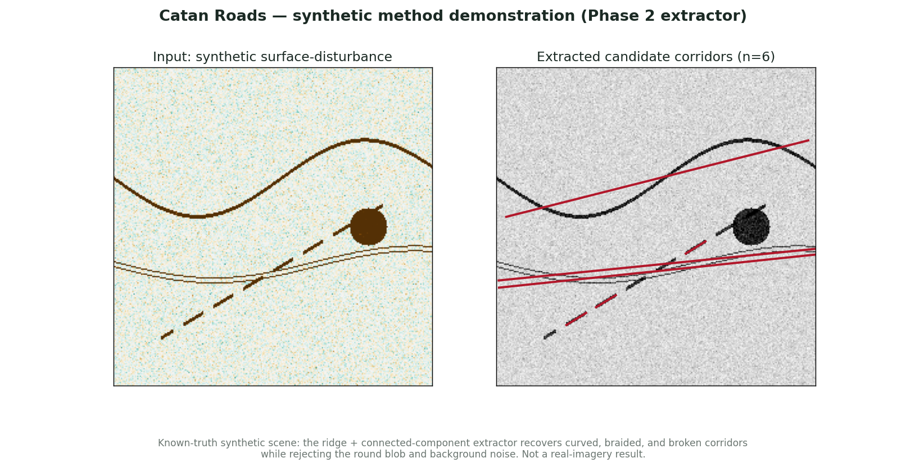

# Catan Roads

**A research prototype for screening positive surface disturbance and extracting
synthetic candidate corridors. Network conditioning and real-road validation in
Mongolia are planned, not demonstrated.**


## Overview

Mongolia has one of the lowest paved-road densities on Earth, and most rural
travel happens on **informal tracks that no map records** — routes that appear,
widen, braid into parallel ruts, and revegetate when disused. Detecting them
matters for logistics and transport planning, disaster response, connectivity
mapping for herder communities, and monitoring the footprint of off-road travel.

Catan Roads is **not** an NDVI road classifier. A single vehicle track is
~2.5–3 m wide and therefore **sub-pixel** at Sentinel-2's 10 m resolution. So the
method targets what a medium-resolution sensor *can* honestly resolve:
**persistent, corridor-scale surface disturbance** — braided corridors, clusters
of parallel tracks, and network-scale change — and produces a **prioritized list
of candidate corridors for confirmation in higher-resolution imagery**. Coarse,
free, and scalable detection feeding targeted high-res confirmation is the design
intent, not a fallback.

> A *desire line* is a path worn into the land by use rather than design.

## Approach

```mermaid
flowchart LR
    classDef input    fill:#bbdefb,stroke:#1565c0,stroke-width:2px,color:#1f2933,font-weight:bold;
    classDef process  fill:#b2dfdb,stroke:#00796b,stroke-width:2px,color:#1f2933;
    classDef core     fill:#e1bee7,stroke:#7b1fa2,stroke-width:2px,color:#1f2933,font-weight:bold;
    classDef result   fill:#ffe0b2,stroke:#ef6c00,stroke-width:2px,color:#1f2933;
    classDef endpoint fill:#f8bbd0,stroke:#c2185b,stroke-width:2px,color:#1f2933,font-weight:bold;

    A[/Two multi-year same-season Sentinel-2 baselines/]:::input --> B[ΔNDVI + ΔBSI composite disturbance]:::process
    B --> C[Local-control normalization]:::process
    C --> D[Persistence weighting]:::process
    D --> E{{Network-conditioned corridor extraction}}:::core
    E --> F(Ranked candidate corridors):::result
    F --> G([High-resolution confirmation queue]):::endpoint
```



*Shapes: parallelogram = input · rectangle = process · hexagon = core method · rounded = result · pill = endpoint.*

The diagram describes the intended full pipeline. Network conditioning, route
grouping and the confirmation queue are not an implemented end-to-end detector.

| Stage | What it does |
| --- | --- |
| **Temporal evidence** | Build two multi-year, same-season baselines (2018–2021 vs 2023–2026, with 2022 as a buffer) rather than two single dates, suppressing year-to-year noise. |
| **Composite disturbance** | Fuse vegetation loss (ΔNDVI) and exposed-surface gain (ΔBSI) into one disturbance score — treated as *related* channels, not two independent measurements. |
| **Local-control normalization** | Express disturbance against a 200–800 m control annulus that excludes the candidate corridor itself, on a fixed 10 m grid. |
| **Persistence** | Weight by the fraction of valid recent years the disturbance holds and require at least two valid years, preventing one clear observation from scoring as fully persistent. |
| **Network conditioning** | Score proximity to OpenStreetMap intersections/endpoints — as a *ranking signal*, keeping both all-area and network-seeded candidate sets for ablation. |
| **Corridor grouping** | Merge parallel ruts into functional route corridors (the Mongolia-specific target). |

The full technical design, decisions, and the developed Phase 0–4 plan are in
**[`docs/design.md`](docs/design.md)**. Study sites (development, holdout,
confound, and a road-free negative control) are declared in
**[`config/sites.geojson`](config/sites.geojson)**.

## Distinctive decisions

- **Corridors, not single tracks.** Sub-pixel tracks are out of scope for direct
  detection; braided/parallel-track corridors are the resolvable, distinctive target.
- **Soft-handle land cover.** Only permanent water is hard-masked; cropland and
  built-up areas are evaluation *strata* and confounds, not erased (which would
  delete real road branches near settlements).
- **OSM as a score, not a gate.** Requiring every candidate to touch a mapped node
  would discard genuinely disconnected routes, so seeding is a rank, and
  seeded-vs-unseeded detection is itself a planned result.
- **Negative controls first.** The signal must be quantitatively weaker at a
  road-free control site than at development sites *before* any line extraction —
  this is the project's falsification gate. The pre-registered primary rule is:
  at least two of three verified development sites must have a large-component
  candidate fraction at least `max(2 × negative-01, 0.0001)`, with at least 90%
  analyzable coverage at every compared site.

## Tech stack

- **Imagery:** Copernicus **Sentinel-2** SR (~10 m, 2017–present); optional
  Sentinel-1 backscatter later
- **Compute:** **Google Earth Engine** (free for noncommercial use)
- **Reference network & GIS:** **OpenStreetMap**, **QGIS**
- **Raster→vector (planned):** Python — `rasterio`, `scikit-image`, `shapely`,
  `geopandas`, `networkx`

## Results

### Real-world results — pending the Phase-1 gate


*Legacy placeholder from the earlier full-field divergent rendering. It is not a
Phase-1 gate output. The current script displays only water-safe, persistent
candidates that meet the registered mask and reports fixed-scale statistics instead
of asking the map to carry the conclusion. Contains modified Copernicus Sentinel-2
data, processed in Google Earth Engine.*

> **Placeholder.** No real-imagery result is claimed yet: per the go/no-go gate, a
> Mongolia result is only reported once the disturbance signal is shown to survive
> a road-free negative control (see [`docs/design.md`](docs/design.md)). Generate a
> map with the workflow below; [`results/`](results/) has the compose step.

### Method demonstration (synthetic)



*Known-truth synthetic scene. The Phase-2 ridge + connected-component extractor
([`analysis/`](analysis/)) localizes curved, braided, and broken corridors and
**rejects the round blob and background noise** — the tooling analogue of the
negative-control gate (5/5 extractor unit tests green, plus 4 tests pinning this
figure's numeric output). This validates the extractor; it is
**not** a Mongolia result. Reproduce: `python analysis/demo_synthetic.py`.*

## Reproduce the analysis

1. Visually verify the three development sites and `negative-01` in dated
   high-resolution imagery. Record the imagery date/provenance and set
   `verified=true` in [`config/sites.geojson`](config/sites.geojson). Unverified
   runs are QA-only and cannot enter the gate.
2. Mirror those verification fields in the `SITES` block, select a registered
   `SITE_ID`, and paste [`gee/ndvi_change.js`](gee/ndvi_change.js) into the
   [Earth Engine Code Editor](https://code.earthengine.google.com/). Do not replace
   the registered AOI with the former Ulaanbaatar default.
3. Run the frozen primary configuration at all three development sites and
   `negative-01`. For each site, start the Tasks-tab `*_gate_metrics` table export
   and record `large_component_fraction` and `coverage_fraction` from its CSV.
   The batch CSV is authoritative because a full-resolution interactive print can
   exceed the Code Editor timeout; never read a gate result from the rendered map.
4. Use the [Phase-1 intake runbook](docs/PHASE1_RUNBOOK.md) to check the four CSVs
   with `python -m catanroads.phase1_gate`. It rejects unverified references,
   incomplete rows, non-finite fractions and mismatched primary settings.
   Run sensitivity settings only after preserving the primary result.
5. Export the float raster, including `candidate_mask`, `n_valid`, and
   `large_component_mask`, plus the one-row gate-metrics CSV. For Phase-1 road
   context, overlay the raster in QGIS on a dated Geofabrik/OpenStreetMap extract;
   Google HYBRID tiles are visual QA only.

Check that the site mirror, shared z threshold, four-layer limit, water-safe mask,
and required export bands have not drifted:

```bash
node tools/validate_phase1.mjs
```

## Status & roadmap

Local CI workflow and intake tests are implemented in this sprint worktree;
hosted Actions has not run. All six reference sites remain unverified. See the
[six-day roadmap](docs/SPRINT_ROADMAP.md) and [task ledger](docs/SPRINT_TASKS.csv).

Early development. **In place:** the reframed problem, the fixed-scale quantitative
Phase-1 gate and Earth Engine pipeline (`gee/ndvi_change.js`), the site manifest, the figure
workflow, and a **Phase-2 candidate extractor validated on synthetic corridors**
([`analysis/`](analysis/), 9/9 tests: 5 extractor unit tests plus 4 pinning the
demo figure's numeric output). **Next (Phase 0/1):** visually verify the
registered sites with dated reference imagery, freeze their provenance, and run the
pre-registered development-vs-negative-control statistic. Only a passing gate allows
the extractor to run on real data. **Then:** network conditioning and corridor-level
evaluation. See [`docs/design.md`](docs/design.md).

## Methodological rigor

- **Same season, multi-year baselines** — or the signal measures grass, not roads.
- **Local-control normalization is implemented in code**, not just asserted:
  disturbance is compared with a fixed-scale annulus that excludes the corridor.
- **Map and gate share a fixed grid** — thresholding, connected components,
  regional statistics, and export all use the same declared 10 m analysis scale.
- **Missing years cannot masquerade as persistence** — `n_valid >= 2` is part of
  the candidate mask and both fields are exported for downstream analysis.
- **Related indices, honestly named** — ΔNDVI and ΔBSI share bands, so their
  agreement is a *composite* score, not two independent confirmations.
- **Resolution honesty as a result** — the project reports the minimum corridor
  width/braiding Sentinel-2 can resolve, a defensible finding regardless of outcome.
- The Phase-1 mask selects **positive disturbance only**. Recovery generally
  has the opposite sign, and stable bare tracks need not change at all.
  `dev-02-recovering` therefore does not validate recovery detection through
  this gate. Retain its registered role and report the mismatch; any sign-aware
  recovery experiment needs a prospective amendment, not a post-hoc site swap.
- The output is *candidate positive-disturbance evidence* — **not** traffic
  volume, vehicle counts, or a validated active/abandoned label.

## License

[MIT](LICENSE)
