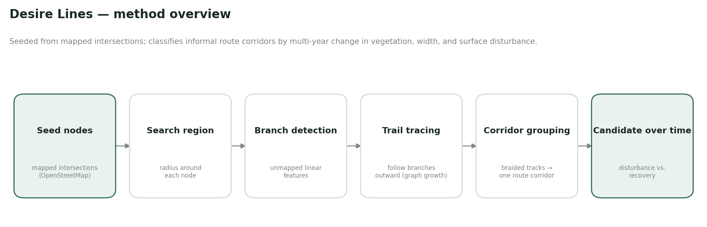
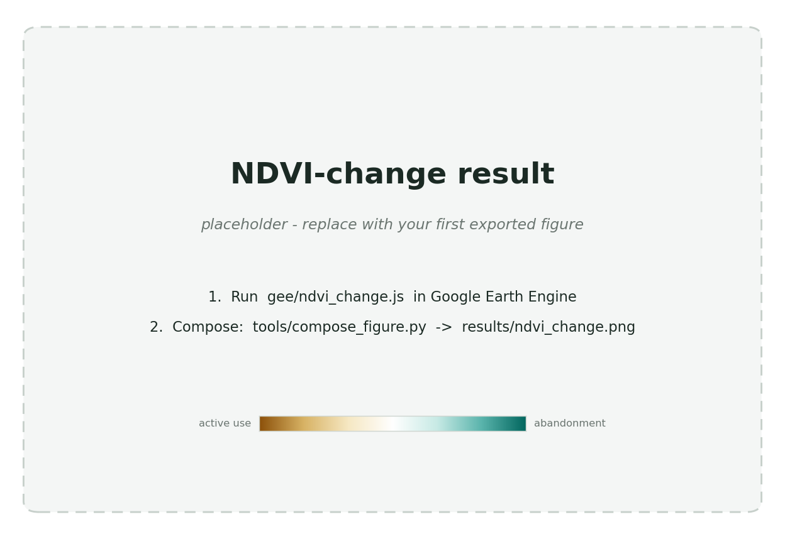

# Desire Lines

**Detecting active and abandoned informal route corridors in Mongolia from
multi-year satellite imagery.**

## Overview

Mongolia has one of the lowest paved-road densities on Earth, and most rural and
inter-settlement travel happens on **informal tracks that no map records**. These
routes are dynamic: they appear, widen, braid into parallel ruts around obstacles,
and quietly revegetate when people stop driving them. Conventional road datasets
capture almost none of this, which leaves a real gap for logistics and transport
planning, disaster response, connectivity mapping for remote herder communities,
and monitoring the environmental footprint of off-road travel on grassland.

**Desire Lines** is a remote-sensing method for finding and classifying these
corridors. Rather than segmenting an entire country blindly, it seeds from
**known mapped intersections**, searches outward for **unmapped branches**, traces
them, and uses **year-over-year change** in vegetation cover, apparent track
width, and surface disturbance to estimate whether a corridor is **active or
abandoned** — with explicit handling of the *braided* parallel tracks that are
characteristic of open-terrain driving.

> A *desire line* is a path worn into the land by use rather than design.

## Approach

| Stage | What it does |
| --- | --- |
| **Seed nodes** | Start from mapped intersections and endpoints (OpenStreetMap or an authorized GIS layer), filtered to meaningful rural forks and low-degree nodes. |
| **Search & detect** | Within a radius of each node, identify candidate linear features not present in the reference network, scored on origin, continuity, surface disturbance, width, and terrain feasibility. |
| **Trail tracing** | Follow each branch outward as graph growth, allowing splits, until it rejoins the network, reaches a destination, or the evidence fades. |
| **Corridor grouping** | Merge braided parallel tracks into a single **route corridor** with a dominant centerline, corridor width, and active-track fraction. |
| **Temporal classification** | Compare season-matched imagery across years to label evidence of increasing, stable, decreasing, or absent recent use. |

The full technical design — node filtering, branch and trail scoring functions,
corridor modeling, a reference-vehicle envelope, quantitative activity thresholds,
the ablation plan, and ground-truth strategy — is documented in
**[`docs/design.md`](docs/design.md)**.

## What makes it distinctive

- **Node-seeded, not brute-force.** Tracing from mapped intersections targets the
  search where new roads actually originate, which should beat whole-area
  segmentation on precision and network connectivity.
- **Braided-corridor modeling.** Representing several physical ruts as one
  functional corridor is the core Mongolia-specific contribution — and where
  ordinary road-extraction methods break.
- **Time as the signal.** The goal is not a static map but a read on *change*:
  vegetation regrowth as evidence of abandonment, surface disturbance as evidence
  of active use.

## Tech stack

- **Imagery:** Copernicus **Sentinel-2** Surface Reflectance (~10 m, 2017–present)
- **Compute:** **Google Earth Engine** for archive-scale temporal analysis
- **Reference network & GIS:** **OpenStreetMap**, **QGIS**
- **Analysis:** Python (planned pipeline), NDVI and change detection

## Status & roadmap

Early development. In place today: the problem formulation, the full methodology,
and a reproducible **exploratory analysis tool** — a Google Earth Engine script
that builds season-matched, multi-year Sentinel-2 NDVI-change maps over any area
of interest. On the roadmap: automated branch detection and trail tracing,
corridor grouping, quantitative activity classification, and validation against
ground truth. See [`docs/design.md`](docs/design.md).

## Results

*Example output. Brown marks vegetation loss / surface disturbance (evidence of
active use); green marks regrowth (evidence of abandonment); linear features are
candidate route corridors. Contains modified Copernicus Sentinel-2 data,
processed in Google Earth Engine.*

> The figure above is a placeholder. Generate one for any area of interest with
> the workflow below; see [`results/`](results/) for the one-command compose step
> that adds the title, legend, scale bar, and attribution.

## Reproduce the exploratory analysis

1. Open the [Google Earth Engine Code Editor](https://code.earthengine.google.com/).
2. Paste [`gee/ndvi_change.js`](gee/ndvi_change.js).
3. Set the `aoi` rectangle to a region of interest and pick two years in the same
   month (season matching is essential — see below).
4. Run. In the change layer, brown marks vegetation loss / surface disturbance
   (evidence of active use) and green marks regrowth (evidence of abandonment);
   the linear features are candidate corridors. Export the raster to overlay
   OpenStreetMap roads in QGIS.

## Methodological rigor

Honest constraints are treated as first-class requirements, not afterthoughts:

- **Season and sensor must be matched** across years, or the analysis measures
  seasonal vegetation instead of road activity.
- **Vegetation change is confounded** by drought, grazing, fire, and rainfall, so
  a track is always compared against its surrounding control area.
- **Surface scars persist**, so abandonment requires temporal *recovery* evidence,
  not mere current visibility.
- The defensible output is *evidence of change in use* — **not** traffic volume or
  vehicle counts.

## License

[MIT](LICENSE)
